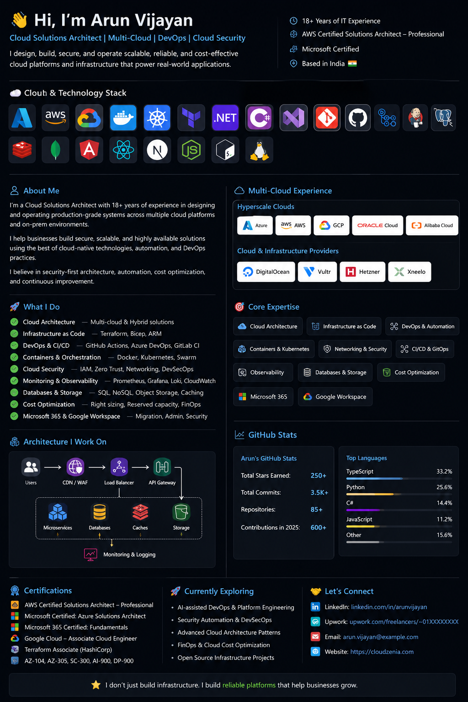

<p align="center">
  
</p>
# 👋 Hi, I'm Arun Vijayan

### Cloud Solutions Architect | Multi-Cloud | DevOps | Cloud Security | Infrastructure & Platform Engineering

I design, build, secure, automate, and operate **production-grade cloud and infrastructure platforms**.

With **18+ years of experience in IT infrastructure, cloud, DevOps, and systems engineering**, I've worked across hyperscale cloud platforms, regional cloud providers, dedicated infrastructure, SaaS platforms, and enterprise collaboration environments.

My approach is simple:

> **Choose the right architecture and platform for the problem, rather than forcing every problem into one cloud.**

---

## ☁️ Multi-Cloud Experience

I've worked hands-on across a broad range of cloud and infrastructure platforms.

### Hyperscale Cloud

* **Microsoft Azure**
* **Amazon Web Services (AWS)**
* **Google Cloud Platform (GCP)**
* **Oracle Cloud Infrastructure (OCI)**
* **Alibaba Cloud**

### Cloud & Infrastructure Providers

* **DigitalOcean**
* **Vultr**
* **Hetzner**
* **Xneelo**
* Other VPS, dedicated-server, and hosting environments

My experience ranges from **small VPS-based deployments to large production environments involving microservices, containers, databases, networking, security, monitoring, CDN/WAF, CI/CD, and enterprise integrations.**

---

## 🏢 Microsoft & Google Ecosystems

### Microsoft

* Microsoft 365
* Entra ID
* Exchange Online
* Microsoft Teams
* SharePoint
* OneDrive
* Azure
* Azure DevOps
* Microsoft Defender ecosystem
* Microsoft Graph

### Google

* Google Workspace
* Google Cloud
* Google Cloud IAM
* Google Cloud networking
* Google Workspace administration

I've worked with both **cloud infrastructure and enterprise identity/collaboration environments**, including migrations, tenant administration, identity, email, security, and hybrid integrations.

---

## 🛠️ Core Engineering Areas

### ☁️ Cloud Architecture

`AWS` `Azure` `GCP` `OCI` `Alibaba Cloud`

`DigitalOcean` `Vultr` `Hetzner` `Xneelo`

### 🏗️ Infrastructure as Code

`Terraform` `Bicep` `ARM Templates`

### 🚀 DevOps & CI/CD

`GitHub Actions` `Azure DevOps` `GitLab CI/CD`

`Docker` `Kubernetes` `Docker Swarm`

`Octopus Deploy` `Harbor` `Container Registries`

### 🌐 Networking

`VPC` `VNet` `Private Endpoints` `VPN`

`Load Balancers` `CDN` `WAF` `DNS`

`CloudFront` `Azure Front Door` `API Management`

`Traefik` `Nginx`

### 🔐 Security

`Cloud Security` `DevSecOps` `IAM` `RBAC`

`Zero Trust` `Network Security`

`Secrets Management` `WAF`

`SAST` `Dependency Security` `Container Security`

`Security Auditing`

### 📊 Observability

`Prometheus` `Grafana` `Loki`

`CloudWatch` `Azure Monitor`

`Log Analytics` `Application Insights`

### 🗄️ Data & Infrastructure

`Azure SQL` `SQL Server` `PostgreSQL` `MySQL`

`Amazon RDS` `Redis` `MongoDB`

`S3` `Azure Blob Storage` `Object Storage`

`RabbitMQ` `NATS`

---

## 🧩 What I Work On

### Cloud Architecture

Designing scalable and secure architectures for:

* SaaS platforms
* Microservices
* APIs
* Enterprise applications
* E-commerce platforms
* Data platforms
* Healthcare systems
* Education platforms
* High-availability production systems

### Infrastructure Engineering

Building and operating:

```text
Cloud Infrastructure
        │
        ├── Networking
        ├── Compute
        ├── Containers
        ├── Databases
        ├── Storage
        ├── Caching
        ├── Messaging
        ├── Security
        ├── Monitoring
        └── CI/CD
```

### Cloud Migration

I work with migrations involving:

* On-premises → Cloud
* AWS → Azure
* Azure → AWS
* VPS → Cloud
* Traditional servers → Containers
* Monolith → Microservices
* Manual infrastructure → Infrastructure as Code

---

## 🔐 Security-First Architecture

Security is treated as part of the architecture, not an afterthought.

```text
Identity
   ↓
Least Privilege
   ↓
Network Segmentation
   ↓
Private Connectivity
   ↓
Secrets Management
   ↓
Application Security
   ↓
Infrastructure Security
   ↓
Logging & Monitoring
   ↓
Detection & Response
```

I also perform security assessments covering:

* Cloud infrastructure
* APIs
* Web applications
* Containers
* CI/CD pipelines
* IAM
* Network configuration
* Secrets and credentials
* Repository security
* Infrastructure as Code

---

## ⚙️ Platform Engineering

I enjoy building reusable platforms that make development and operations easier.

Typical platform components include:

```text
                    Developers
                        │
                        ▼
                  Git / GitHub
                        │
                        ▼
                    CI / CD
                        │
              ┌─────────┴─────────┐
              ▼                   ▼
          Container            IaC
           Build            Terraform/Bicep
              │                   │
              ▼                   ▼
          Registry             Cloud
              │              Infrastructure
              └─────────┬─────────┘
                        ▼
                 Production
                        │
              ┌─────────┼─────────┐
              ▼         ▼         ▼
           Metrics    Logs     Security
```

---

## 🌍 Cloud Isn't One-Size-Fits-All

I've worked with environments ranging from:

**A single VPS**

```text
Internet → Nginx → Application → Database
```

to:

**Large distributed production platforms**

```text
                    CDN / WAF
                       │
                       ▼
                 Load Balancer
                       │
                 API Gateway
                       │
            ┌──────────┼──────────┐
            ▼          ▼          ▼
         Service A  Service B  Service C
            │          │          │
            └──────────┼──────────┘
                       │
              ┌────────┴────────┐
              ▼                 ▼
          Database            Redis
              │
              ▼
          Object Storage
```

The architecture should match the **business requirement, scale, reliability requirements, security model, and budget**.

---

## 💰 Cloud Cost Optimization

Cloud architecture isn't only about making systems scale.

It's also about making them **economically sustainable**.

I work on:

* Resource right-sizing
* Compute optimization
* Database optimization
* Storage optimization
* Reserved capacity
* Architecture optimization
* Multi-cloud cost comparison
* Infrastructure consolidation
* Monitoring unexpected cost increases

> **The best architecture is not necessarily the most expensive architecture.**

---

## 🤖 Exploring AI + Infrastructure

I'm increasingly interested in the intersection of:

**AI + Cloud + DevOps + Security**

Currently exploring:

* AI-assisted infrastructure engineering
* AI coding agents
* Autonomous DevOps workflows
* AI-powered security analysis
* Infrastructure automation
* Intelligent observability
* AI-assisted cloud operations

---

## 📚 Certifications & Professional Development

* AWS Certified Solutions Architect – Professional
* Microsoft Certified
* Continuous learning across Azure, AWS, GCP, Terraform, Security, DevOps, and Platform Engineering

---

## 📈 GitHub


---

## 🤝 Open to Interesting Problems

I'm particularly interested in projects involving:

* ☁️ Multi-cloud architecture
* 🏗️ Infrastructure as Code
* 🚀 DevOps & Platform Engineering
* 🔐 Cloud Security
* 🌐 Distributed systems
* 🐳 Containers & Kubernetes
* 🤖 AI + Infrastructure
* 💰 Cloud optimization
* 🔄 Cloud migrations
* 🛠️ Open-source infrastructure tooling

---

## ⚡ A Little About My Philosophy

> **I've spent enough time in production to know that architecture diagrams are only the beginning.**

The real engineering starts when:

* traffic suddenly increases,
* DNS stops resolving,
* a certificate expires,
* a database runs out of space,
* a deployment fails at 2 AM,
* an engineer accidentally deletes something,
* or the cloud bill suddenly doubles.

**Building systems that survive those moments is what I enjoy.**

---

### 🌎 Multi-Cloud. Production-Focused. Security-Minded.

**AWS • Azure • GCP • OCI • Alibaba Cloud • DigitalOcean • Vultr • Hetzner • Xneelo • Microsoft 365 • Google Workspace**
