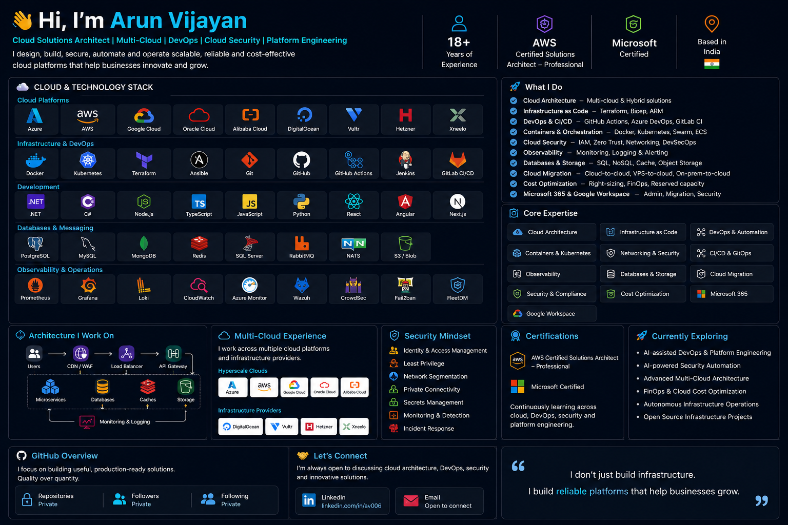

<p align="center">
  
</p>

<p align="center">
  <a href="https://github.com/arunblitz">
    
  </a>
  <a href="https://www.linkedin.com/in/av006/">
    
  </a>
  
</p>

<h2 align="center">👋 Hi, I'm Arun Vijayan</h2>

<p align="center">
  <b>Cloud Solutions Architect · Multi-Cloud · DevOps · Cloud Security · Platform Engineering</b>
</p>

<p align="center">
  I design, build, secure, automate and operate production-grade cloud platforms
  that are scalable, reliable and cost-effective.
</p>

---

# ☁️ Cloud Platforms

### Hyperscale Cloud

<p align="center">

<a href="https://azure.microsoft.com/">

</a>
<a href="https://aws.amazon.com/">

</a>
<a href="https://cloud.google.com/">

</a>

<a href="https://www.oracle.com/cloud/">

</a>

<a href="https://www.alibabacloud.com/">

</a>

</p>

### Cloud & Infrastructure Providers

<p align="center">

<a href="https://www.digitalocean.com/">

</a>

<a href="https://www.vultr.com/">

</a>

<a href="https://www.hetzner.com/">

</a>

<a href="https://xneelo.co.za/">

</a>

</p>

**Cloud experience:**
`Azure` · `AWS` · `GCP` · `Oracle Cloud` · `Alibaba Cloud` · `DigitalOcean` · `Vultr` · `Hetzner` · `Xneelo`

---

# 🏗️ Infrastructure & DevOps

<p align="center">

<a href="https://www.docker.com/">

</a>

<a href="https://kubernetes.io/">

</a>

<a href="https://www.terraform.io/">

</a>

<a href="https://www.ansible.com/">

</a>

<a href="https://git-scm.com/">

</a>

<a href="https://github.com/">

</a>

<a href="https://github.com/features/actions">

</a>

<a href="https://www.jenkins.io/">

</a>

<a href="https://about.gitlab.com/">

</a>

</p>

### Infrastructure as Code

`Terraform` · `Bicep` · `ARM Templates` · `Ansible`

### Containers & Orchestration

`Docker` · `Kubernetes` · `Docker Swarm` · `Azure Container Apps` · `Amazon ECS` · `Traefik`

### CI/CD

`GitHub Actions` · `Azure DevOps` · `GitLab CI/CD` · `Jenkins` · `Octopus Deploy`

### Container & Artifact Platforms

`Amazon ECR` · `Azure Container Registry` · `Harbor`

---

# 💻 Development

<p align="center">

<a href="https://dotnet.microsoft.com/">

</a>

<a href="https://learn.microsoft.com/en-us/dotnet/csharp/">

</a>

<a href="https://nodejs.org/">

</a>

<a href="https://www.typescriptlang.org/">

</a>

<a href="https://www.python.org/">

</a>

<a href="https://react.dev/">

</a>

<a href="https://angular.dev/">

</a>

<a href="https://nextjs.org/">

</a>

</p>

`C#` · `.NET` · `Node.js` · `TypeScript` · `JavaScript` · `Python`

`React` · `Angular` · `Next.js`

---

# 🗄️ Databases, Storage & Messaging

<p align="center">

<a href="https://www.postgresql.org/">

</a>

<a href="https://www.mysql.com/">

</a>

<a href="https://www.mongodb.com/">

</a>

<a href="https://redis.io/">

</a>

<a href="https://www.rabbitmq.com/">

</a>

</p>

**Databases**

`SQL Server` · `PostgreSQL` · `MySQL` · `MongoDB`

**Caching**

`Redis` · `ElastiCache`

**Messaging**

`RabbitMQ` · `NATS` · Event-driven architectures

**Storage**

`Amazon S3` · `Azure Blob Storage` · Object Storage

---

# 🌐 Networking & Edge

Experience across cloud and hybrid networking environments:

`VPC` · `VNet` · `Private Endpoints` · `Private DNS`

`Load Balancers` · `Application Gateway` · `API Management`

`CDN` · `WAF` · `DNS` · `VPN` · `NAT`

`Azure Front Door` · `Amazon CloudFront` · `Traefik` · `Nginx`

### Typical Production Architecture

```text
                           INTERNET
                              │
                        ┌─────▼─────┐
                        │ CDN / WAF │
                        └─────┬─────┘
                              │
                     ┌────────▼────────┐
                     │ Load Balancer   │
                     └────────┬────────┘
                              │
                     ┌────────▼────────┐
                     │ API Gateway/APIM│
                     └────────┬────────┘
                              │
              ┌───────────────┼───────────────┐
              │               │               │
         Service A       Service B       Service C
              │               │               │
              └───────────────┼───────────────┘
                              │
                ┌─────────────┼─────────────┐
                │             │             │
             Database       Redis        Storage
                │             │             │
                └─────────────┼─────────────┘
                              │
                     Monitoring / Logging
```

---

# 🔐 Cloud Security & DevSecOps

Security is part of the architecture, not something added at the end.

### Security Areas

* Identity & Access Management
* Least Privilege
* RBAC
* Zero Trust
* Network Segmentation
* Private Connectivity
* Secrets Management
* API Security
* Container Security
* CI/CD Security
* Infrastructure Security
* DevSecOps
* Security Auditing
* Logging & Detection
* Incident Investigation

### Security Model

```text
Identity
   │
   ▼
Least Privilege
   │
   ▼
Network Segmentation
   │
   ▼
Private Connectivity
   │
   ▼
Secrets Management
   │
   ▼
Application Security
   │
   ▼
Infrastructure Security
   │
   ▼
Logging & Monitoring
   │
   ▼
Detection & Response
```

---

# 📊 Observability & Operations

<p align="center">

<a href="https://prometheus.io/">

</a>

<a href="https://grafana.com/">

</a>

<a href="https://www.linux.org/">

</a>

<a href="https://nginx.org/">

</a>

</p>

`Prometheus` · `Grafana` · `Loki` · `CloudWatch`

`Azure Monitor` · `Log Analytics` · `Application Insights`

`Wazuh` · `CrowdSec` · `Fail2ban` · `FleetDM`

---

# 🏢 Microsoft 365

<p align="center">

<a href="https://www.microsoft.com/microsoft-365">

</a>

<a href="https://www.microsoft.com/security/business/identity-access/microsoft-entra-id">

</a>

<a href="https://www.microsoft.com/microsoft-teams">

</a>

</p>

Experience includes:

`Microsoft 365` · `Entra ID` · `Exchange Online` · `Teams`

`SharePoint` · `OneDrive` · `Microsoft Graph`

Tenant administration · Identity · Migration · Security · Access Control

---

# 🌐 Google Workspace

<p align="center">

<a href="https://workspace.google.com/">

</a>

</p>

Experience includes:

`Gmail` · `Drive` · `Groups` · `Identity`

Workspace administration · Migration · Domain management · Security

---

# 🚀 What I Do

| Area                           | Focus                                                    |
| ------------------------------ | -------------------------------------------------------- |
| ☁️ **Cloud Architecture**      | Multi-cloud, hybrid and cloud-native architecture        |
| 🏗️ **Infrastructure as Code** | Terraform, Bicep, ARM                                    |
| 🚀 **DevOps & CI/CD**          | GitHub Actions, Azure DevOps, GitLab, Jenkins            |
| 🐳 **Containers**              | Docker, Kubernetes, Swarm, ECS, Container Apps           |
| 🔐 **Security**                | IAM, Zero Trust, DevSecOps, network security             |
| 🌐 **Networking**              | VPC/VNet, WAF, CDN, DNS, private networking              |
| 📊 **Observability**           | Prometheus, Grafana, Loki, CloudWatch, Azure Monitor     |
| 🗄️ **Data Platforms**         | SQL, NoSQL, Redis, object storage, messaging             |
| 💰 **FinOps**                  | Right-sizing, optimization and cost reduction            |
| 🏢 **Enterprise IT**           | Microsoft 365, Entra ID, Google Workspace                |
| 🔄 **Cloud Migration**         | Cloud-to-cloud, VPS-to-cloud, on-prem-to-cloud           |
| 🛡️ **Security Auditing**      | Infrastructure, APIs, applications, repositories & CI/CD |

---

# 💰 Cloud Cost Optimization

A good architecture needs to be **technically sound and financially sustainable**.

I work on:

* Resource right-sizing
* Compute optimization
* Database optimization
* Storage optimization
* Reserved capacity
* Architecture optimization
* Multi-cloud cost comparison
* Infrastructure consolidation
* FinOps
* Unexpected cloud spend investigation

> **The best architecture isn't necessarily the most expensive architecture.**

---

# 🤖 AI × Cloud × DevOps × Security

I'm increasingly interested in the intersection of AI and infrastructure engineering.

Currently exploring:

* AI-assisted DevOps
* AI coding agents
* AI-powered security auditing
* Autonomous infrastructure operations
* AI-assisted cloud architecture
* Security automation
* Intelligent observability
* AI-powered platform engineering

---

# 🏆 Certifications

### AWS

**AWS Certified Solutions Architect - Professional**

### Microsoft

**Microsoft Certified**

Continuously expanding expertise across:

`Azure` · `AWS` · `GCP` · `Terraform` · `Cloud Security` · `DevOps`

`Microsoft 365` · `Entra ID` · `Platform Engineering`

---

# 📈 GitHub Activity

<p align="center">


</p>

<p align="center">


</p>

---

# 🧭 Currently Exploring

* 🤖 AI-assisted DevOps & Platform Engineering
* 🔐 AI-powered Security Automation
* ☁️ Advanced Multi-Cloud Architecture
* 💰 FinOps & Cloud Cost Optimization
* 🚀 Autonomous Infrastructure Operations
* 🌎 Open Source Infrastructure Projects
* 🛡️ DevSecOps & Cloud Security

---

# 🤝 Let's Connect

<p align="center">

<a href="https://github.com/arunblitz">

</a>

<a href="https://www.linkedin.com/in/av006/">

</a>

</p>

---

<p align="center">

### ⭐ I don't just build infrastructure.

### I build **reliable platforms** that help businesses grow.

</p>

<p align="center">
  <sub>Cloud • DevOps • Security • Automation • Platform Engineering</sub>
</p>
